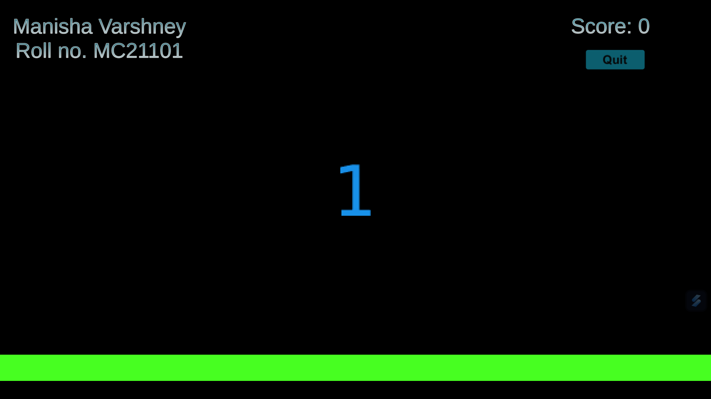
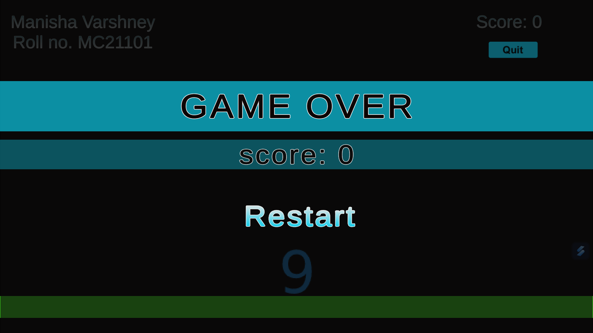

# Number Cruncher

## Overview

Welcome to Number Cruncher, a fast-paced Unity game where numbers fall from the top, and your goal is to press them before they hit the bottom border. Keep the game going by pressing the numbers on time, but be careful – if a number hits the border, it's game over! Challenge yourself to achieve the highest score by reacting swiftly to the falling numbers.

## Contents

- **codes:** Contains all the code files required for the game. All C# files are located in `codes/Assets/Scripts`.
  - `SpawnNums.cs`: Manages the spawning of numbers.
  - `NumBehavior.cs`: Defines the behavior of the falling numbers.
  - `GameOverScript.cs`: Handles the game over screen.
  - `ScoreScript.cs`: Tracks and updates the player's score.

- **build:** Contains the executable application and necessary DLL files to run the game.

---

## How to Run

Follow the steps below to run the Number Cruncher game:

1. **Clone the Repository:**
   ```
   git clone https://github.com/manisha-v/Number-Cruncher.git
   cd Number-Cruncher
   ```

2. **Open Unity:**
   - Open Unity Hub and add the project by selecting the extracted folder.

3. **Run the Game:**
   - Open the main scene.
   - Press the play button in the Unity Editor to run the game.

4. **Or just Run the Executable:**
   - Present in the `build` folder.
   - Run the provided executable file (`Minor2d.exe`) to play the game.

5. **Enjoy:**
   - Press the falling numbers before they hit the bottom border to keep the game going.
   - Aim for the highest score and challenge your reflexes!

## Preview

Game in action - Press the falling numbers!



Game Over - Your final score is displayed.


**Have fun playing Number Cruncher! 🎮**

## Need any help?
Connect me on [LinkedIn](https://www.linkedin.com/in/your-linkedin-profile/)   

Thank you for exploring my Number Cruncher game! If you have any questions or feedback, please don't hesitate to reach out.
